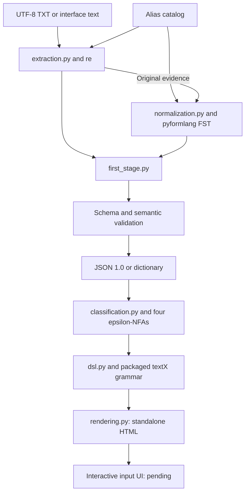

# Module design and integration

Modules separate extraction, normalization, validation and execution to preserve the link between input and output.

## Responsibilities

| Module/function | Input | Output | Relevant condition |
|---|---|---|---|
| catalog.load_catalog | None | Configuration dictionary | Reads packaged resource independently of cwd |
| catalog.validate_catalog | Dictionary | None or ValueError | Unique casefolded aliases |
| extraction.skill_pattern | Catalog | re.Pattern | Escaped alternation, longer aliases first |
| extraction.extract_resume | Text, optional name/catalog | candidate, extracted_skills, excluded_mentions, warnings | Preserves text; does not normalize |
| normalization.build_transducers | Optional catalog | Category → FST dictionary | Independent alias paths; output on final transition |
| normalization.normalize_skills | Evidence list, machines | normalized_skills, normalization_evidence, unknown_skills | Executes FST.translate |
| first_stage.process_resume | Text, optional name | Complete 1.0 object | Public entry point |
| first_stage.validate_result | 1.0 object and exact text | None or exception | Schema, spans, indices and actual translations |
| cli.main | CLI arguments | Exit 0/2, JSON or diagnostic | Preserves CRLF; prevents overwrite by default |
| classification.load_profiles / validate_profile | Packaged configuration / profile dictionary | Four profiles / None or ValueError | Known symbols, nonempty requirements and disjoint buckets |
| classification.profile_branches | Profile dictionary | Allowed and required sets per branch/bucket | Common structure for all four patterns |
| classification.build_profile_automaton | Profile dictionary | pyformlang EpsilonNFA | Loops, required transitions and epsilon composition |
| classification.canonical_sequence | Canonical skills and profile | Ordered relevant symbols | Retains all compatible-pair candidates |
| classification.classify_skills | Canonical-symbol collection | accepted_profiles and four detailed results | Executes accepts(); separate from JSON 1.0 |
| dsl.generate_candidate_dsl | JSON 1.0 and recognition result | Candidate DSL string | JSON escaping, canonical symbols and repeated records |
| dsl.parse_candidate_dsl | Candidate DSL string | Validated candidate dictionary | textX syntax, unique declarations and profile coherence |
| rendering.render_candidate_html | Candidate DSL string | Standalone HTML | Parses before rendering; escapes candidate-derived text |
| workflow.process_complete_resume | Exact text, optional name | First-stage result, classification, DSL, parsed candidate and HTML | Connects all four stages without altering JSON 1.0 |
| workflow.save_bundle | Complete result and destination | Four UTF-8 files | Cross-stage consistency and overwrite preflight |
| workflow_cli.main | CLI arguments | Exit 0/2, bundle or diagnostic | BOM/CRLF compatibility and original-input protection |

## Types and evidence

Evidence is `{raw: str, start: int, end: int}` in Python characters, not bytes. ExcludedEvidence adds `reason`. NormalizationEvidence is `{extracted_index: int, canonical: str}`, addressing evidence rather than unique symbols. Names are `str | None`; other candidate fields are evidence lists.

Packaged catalog/schema copies match `config/` and `contracts/`; tests detect divergence. Symbol changes affect schema enum and profile patterns. Incompatible changes require an agreed contract version.

## Education and experience

Known headings, with or without colons, start sections. Each nonempty following line is a record until another heading. Bullets and surrounding whitespace are removed without losing offsets. Explicit section records take priority over contained phrases, preventing duplicates. Outside sections, supported degree and experience phrases are recognized.

A line is one evidence record, not necessarily an entire job. Grouping multiline descriptions into structured positions would require additional rules and a new contract.

## Context and negation

JS/TS require skills headings with recognized-alias continuation lists. Unsuffixed React accepts that context, supported development/work phrases ending in using/with or Spanish equivalents, or a following framework/library word. React.js/ReactJS remain literal.

Pandas accepts skills sections or both an immediate use verb and a data analysis/processing complement. Capitalization alone is insufficient.

Eight negation patterns cover the immediate alias or a list separated by comma, slash or and/or/y/o. Closing punctuation, semicolons and contrast connectors end scope. Double negation and irony remain unsupported.

## Errors and shared state

Empty input is rejected. The CLI reports invalid files, encoding and input/output identity in English. Default FSTs are built once and privately cached; results are fresh on every call. There is no persistent candidate state or UI dependency.

JSON is a data boundary, not proof of profile acceptance. Recognition now returns its results in a separate object; textX validates the separate candidate representation before future visualization. HTML is generated only after that validation; the input UI remains a subsequent increment. Packaged profile configuration matches `config/profiles_design.json`, checked by tests. Private cached machines are reused; callers receive fresh result data.
